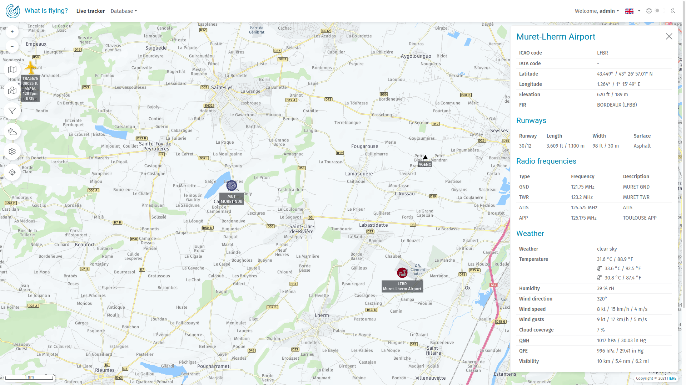
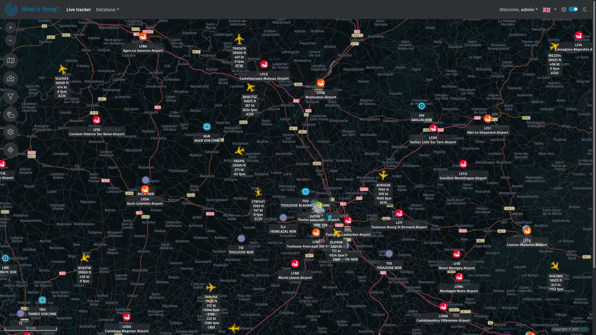

    

# What is flying?

Real time aircraft tracker & aeronautical database, build with Vue.js 3, PHP 8, Symfony 5 and API platform.

## Screenshots

    
    
    
    
    
    
    
    
    

## Getting started

[Getting started](docs/GETTING_STARTED.md)

## Supported browsers

We target browsers that supports the following features:

- [ECMAScript 2015 (ES6)](https://www.caniuse.com/es6).
- [Pointer events](https://www.caniuse.com/pointer)
- [TLS 1.3](https://www.caniuse.com/tls1-3)

It means the following browsers are currently supported:

|                                                              | Browser             | Supported versions |
| ------------------------------------------------------------ | ------------------- | ------------------ |
|  | Android WebView     | 90+                |
|  | Chrome              | 70+                |
|  | Chrome for Android  | 90+                |
|  | Edge                | 79+                |
|  | Firefox             | 63+                |
|  | Firefox for Android | 87+                |
|  | Opera               | 57+                |
|  | Opera Mobile        | 62+                |
|  | Safari              | 14+                |
|  | Safari for iOS      | 12.2+              |
|  | Samsung Internet    | 10.1+              |

## Thanks

- [OpenSky Network](https://opensky-network.org/) for their API without which this project would not exist.
